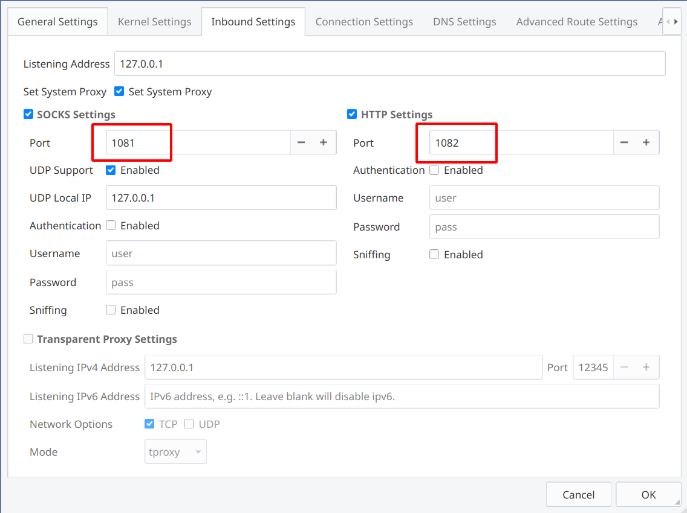
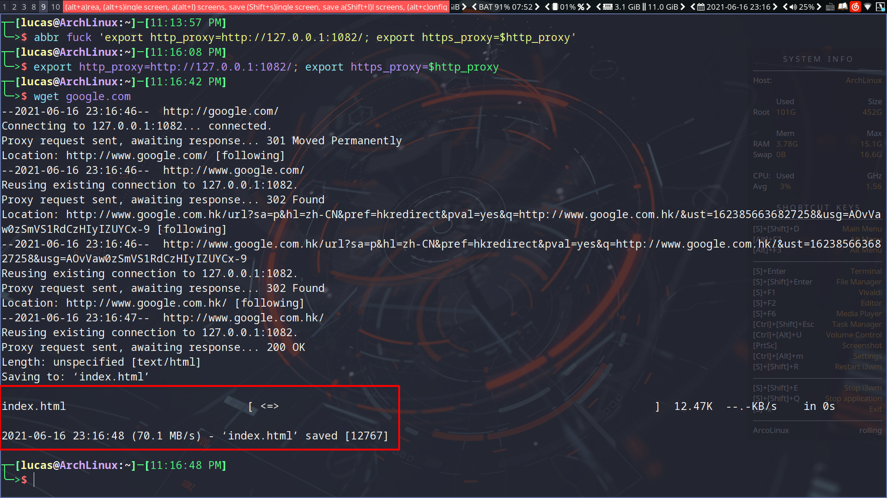
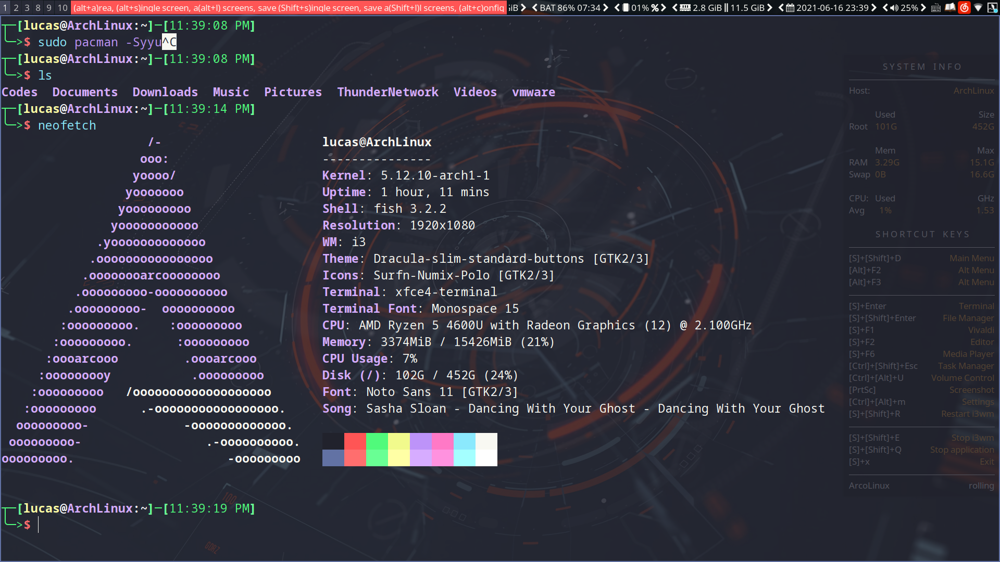

   * [Table of Contents](#table-of-contents)
   * [系统维护](#系统维护)
      * [Ucode](#ucode)
      * [设置 Grub](#设置-grub)
      * [解决关机、重启时间过长](#解决关机重启时间过长)
      * [电源管理](#电源管理)
      * [SSD](#ssd)
      * [垃圾清理](#垃圾清理)
   * [系统设置](#系统设置)
      * [Locale](#locale)
      * [命令行代理](#命令行代理)
      * [设置默认软件](#设置默认软件)
   * [显示](#显示)
      * [解决屏幕撕裂](#解决屏幕撕裂)
      * [SDDM](#sddm)
      * [夜间模式](#夜间模式)
      * [Hardware video acceleration](#hardware-video-acceleration)
      * [字体](#字体)
      * [DPI](#dpi)
      * [设置主题](#设置主题)
      * [Dracula color theme](#dracula-color-theme)
         * [fish](#fish)
         * [JetBrains](#jetbrains)
         * [i3wm](#i3wm)
            * [Install](#install)
            * [Activating the theme](#activating-the-theme)
         * [GTK and QT](#gtk-and-qt)
         * [Visual Studio Code](#visual-studio-code)
            * [Install using Command Palette](#install-using-command-palette)
         * [Xfce4-terminal](#xfce4-terminal)
            * [Install using Git](#install-using-git)
            * [Activating theme](#activating-theme)
   * [Hypervisors](#hypervisors)
      * [Vmware](#vmware)
         * [Tips](#tips)
            * [CPU](#cpu)
            * [Enable 3D graphics](#enable-3d-graphics)
            * [Disable transparent hugepages](#disable-transparent-hugepages)
            * [Virtual machine settings](#virtual-machine-settings)
            * [取消 Enable drag and drop](#取消-enable-drag-and-drop)
      * [KVM](#kvm)
   * [视频](#视频)
      * [统计文件下的所有视频长度](#统计文件下的所有视频长度)
      * [annie](#annie)
         * [Commands](#commands)
      * [youtube-dl](#youtube-dl)
         * [Configuration](#configuration)
         * [Commands](#commands-1)
         * [Subtitle Options](#subtitle-options)

Created by [gh-md-toc](https://github.com/ekalinin/github-markdown-toc)


# 系统维护

## Ucode

```bash
sudo pacman -S amd-ucode
```


## 设置 Grub

```bash
sudo vim /etc/default/grub
```

```bash
GRUB_TIMEOUT=1
GRUB_TIMEOUT_STYLE=hidden
```

```bash
sudo grub-mkconfig -o /boot/grub/grub.cfg
reboot
```


## 解决关机、重启时间过长

```bash
sudo vim /etc/systemd/system.conf
```

```bash
RebootWatchdogSec=10s
DefaultTimeoutStartSec=5s
DefaultTimeoutStopSec=5s
```


## 电源管理

```bash
sudo pacman -S tlp powertop
sudo systemctl enable tlp
```


## SSD

```bash
sudo systemctl enable --now fstrim.timer
```


## 垃圾清理

> - https://averagelinuxuser.com/clean-arch-linux/
> - https://wiki.archlinux.org/title/Pacman/Tips_and_tricks#Identify_files_not_owned_by_any_package

```bash
# 清除未安装的 pacman 缓存
sudo pacman -Sc 

yay -Sc

# 清除所有 pacman 缓存
sudo pacman -Scc

yay -Scc

# 清除 Orphan package (Remove unneeded dependencies)，这个很好用
yay -Yc

# Identify files not owned by any package
sudo pacman -S pacutils
sudo pacreport --unowned-files # 然后根据输出结果选择你要删除的东西

# 下面的文件请小心清理
# $HOME/.cache/
# $HOME/.cache/yay
# $HOME/.local/share/
# $HOME/.config/
```

<br>

<br>

# 系统设置

## Locale

```bash
sudo sed 's/#zh_CN.UTF-8 UTF-8/zh_CN.UTF-8 UTF-8/' -i /etc/locale.gen
sudo locale-gen
```


## 命令行代理  

我的代理配置如下：



在 fish 中设置命令行代理：

```bash
export http_proxy=http://127.0.0.1:1082/; export https_proxy=$http_proxy
```

可以将上面的代码设置为一个 fish abbreviation：

```bash
abbr fuck 'export http_proxy=http://127.0.0.1:1082/; export https_proxy=$http_proxy'
```

测试：




## 设置默认软件

可以通过 xfce4-mime-settings 来设置默认软件，也可以通过右键点击文件来设置默认软件。

<br>

<br>

# 显示

## 解决屏幕撕裂

```bash
sudo vim /etc/X11/xorg.conf.d/20-amdgpu.conf
```

```bash
Section "Device"
	Identifier "AMD"
	Driver "amdgpu" 
	Option "TearFree" "true"
EndSection
```


## SDDM

```bash
# 在虚拟机下这三个可能有点慢
yay -S sddm-sugar-candy-git sddm-config-editor-git sddm-sugar-dark sddm-sugar-light
```

Preview:

```bash
sddm-greeter --test-mode --theme /usr/share/sddm/themes/sugar-candy
```

然后使用 arcolinux-tweak-tool 设置新的主题。


## 夜间模式

```bash
sudo pacman -S redshift
```

在 i3 config 中设置自启动：

```bash
# Night mode
exec --no-startup-id redshift -P -O 5500
```


## Hardware video acceleration

> https://wiki.archlinux.org/title/Hardware_video_acceleration

```bash
# AMD
sudo pacman -S libva-mesa-driver mesa-vdpau
```


## 字体

```bash
sudo pacman -S noto-fonts-cjk noto-fonts-emoji
sudo pacman -S ttf-font-awesome
sudo pacman -S ttf-cascadia-code
yay -S consolas-font

sudo pacman -S font-manager
```

### 偷 Windows 的字体

首先在 Windows 下 `` 复制字体文件，然后将其复制到 Linux 下。

可以复制到 `~/.local/share/fonts` 或者 `/usr/local/share/fonts/`。

然后重启即可。

### 配置字体

创建 ~/.config/fontconfig/fonts.conf 文件：

```xml
<?xml version="1.0"?>
<!DOCTYPE fontconfig SYSTEM "fonts.dtd">
<fontconfig>
    <match target="font">
        <edit mode="assign" name="hinting" >
            <bool>true</bool>
        </edit>
        <edit mode="assign" name="autohint" >
            <bool>true</bool>
        </edit>
        <edit mode="assign" name="hintstyle" >
            <const>hintslight</const>
        </edit>
        <edit mode="assign" name="rgba" >
            <const>rgb</const>
        </edit>
        <edit mode="assign" name="antialias" >
            <bool>true</bool>
        </edit>
        <edit mode="assign" name="lcdfilter">
            <const>lcddefault</const>
        </edit>
    </match>

<!-- Set preferred serif, sans serif, and monospace fonts. -->
    <alias>
        <family>serif</family>
        <prefer>
            <family>Microsoft Yahei</family>
            <family>Noto Serif</family>
            <family>Noto Serif CJK SC</family>
            <family>Noto Serif CJK TC</family>
            <family>Noto Serif CJK JP</family>
            <family>Noto Serif CJK KR</family>
            <family>Droid Serif</family>
        </prefer>
    </alias>
    <alias>
        <family>sans-serif</family>
        <prefer>
            <family>Microsoft Yahei</family>
            <family>Noto Sans</family>
            <family>Noto Sans CJK SC</family>
            <family>Noto Sans CJK TC</family>
            <family>Noto Sans CJK JP</family>
            <family>Noto Sans CJK KR</family>
            <family>Droid Sans</family>
        </prefer>
    </alias>
    <alias>
        <family>monospace</family>
        <prefer>
            <family>Consolas</family>
            <family>Cascadia Mono PL</family>
            <family>Droid Sans Mono</family>
            <family>Noto Sans Mono</family>
        </prefer>
    </alias>
    <alias>
        <family>mono</family>
        <prefer>
            <family>Consolas</family>
            <family>Cascadia Mono PL</family>
            <family>Droid Sans Mono</family>
            <family>Noto Sans Mono</family>
        </prefer>
    </alias>

</fontconfig>
```

这样就能正常显示中文了。


## DPI

> https://wiki.archlinux.org/title/HiDPI

默认的 100% 缩放下标题、菜单文字还是太小了，有点伤眼睛，因此我们需要更改 [DPI](https://wiki.archlinux.org/title/HiDPI)。

通过 ~/.Xresources 文件更改 DPI：

```bash
vim ~/.Xresources
```

```bash
Xft.dpi: 110

! These might also be useful depending on your monitor and personal preference:
Xft.autohint: 0
Xft.lcdfilter:  lcddefault
Xft.hintstyle:  hintfull
Xft.hinting: 1
Xft.antialias: 1
Xft.rgba: rgb
```

DPI 默认数值为 96。如果我想要 1.15 倍缩放，那么 DPI 的数值就是 96 * 1.15 = 110。


## 设置主题

可以通过 lxappearance 设置。

### 解决 lxappearance 无法更改 Mouse Cursor

> - https://wiki.archlinux.org/title/Cursor_themes

直接编辑 `~/.icons/default/index.theme` 以及 `~/.config/gtk-3.0/settings.ini`：

```
[Icon Theme]
Name=Bibata-Modern-Amber
Comment=Bibata-Modern-Amber
Inherits=Bibata-Modern-Amber
```

```
gtk-cursor-theme-name=Bibata-Modern-Amber
```

然后 logout 或者 reboot 即可。


## Dracula color theme

> https://draculatheme.com/

### fish

> https://draculatheme.com/fish

```bash
fisher install dracula/fish # 利用 fisher 安装
fish_config # 然后通过 fish_config 选择
```




### JetBrains

> https://draculatheme.com/jetbrains

> Go to `Plugin Marketplace`, and search `Dracula`, click `Install`.
>
> Go to `Preferences | Appearance & Behavior | Appearance`, select `Dracula` from the dropdown menu.


### i3wm

> https://draculatheme.com/i3

> #### Install
>
> Download using the [GitHub .zip download](https://github.com/dracula/i3/archive/master.zip) option.
>
> #### Activating the theme
>
> Append the colour palettes in `.config` to your existing i3 configuration files.


### GTK and QT

```bash
yay -S dracula-gtk-theme
```


### Visual Studio Code

> https://draculatheme.com/visual-studio-code

> #### Install using Command Palette
>
> 1. Go to `View -> Command Palette` or press `Ctrl+Shift+P`
> 2. Then enter `Install Extension`
> 3. Write `Dracula Official`
> 4. Select it or press Enter to install


### Xfce4-terminal

> https://draculatheme.com/xfce4-terminal

> #### Install using Git
>
> If you are a git user, you can install the theme and keep up to date by cloning the repo:
>
> ```
> $ git clone https://github.com/dracula/xfce4-terminal.git
> ```
>
> #### Activating theme
>
> 1. Put `Dracula.theme` in `~/.local/share/xfce4/terminal/colorschemes`


# Hypervisors

## Vmware

**First install vmware,**

```bash
sudo pacman -S vmware-workstation
```

**Then,** as desired, enable some of the following services:

- `vmware-networks.service` for guest network access

  ```bash
  sudo systemctl enable --now vmware-networks.service
  ```

- `vmware-usbarbitrator.service` for connecting USB devices to guest

  ```bash
  sudo systemctl enable --now vmware-usbarbitrator.service
  ```

**And** load the VMware modules:

```bash
sudo modprobe -a vmw_vmci vmmon
```

**Lastly,** entering the Workstation Pro license key from a terminal:

```bash
sudo /usr/lib/vmware/bin/vmware-vmx-debug --new-sn ZF3R0-FHED2-M80TY-8QYGC-NPKYF
```

**16.0 License Key**

```bash
ZF3R0-FHED2-M80TY-8QYGC-NPKYF
YF390-0HF8P-M81RQ-2DXQE-M2UT6
ZF71R-DMX85-08DQY-8YMNC-PPHV8
```


### Tips

#### Enable 3D graphics

```bash
echo 'mks.gl.allowBlacklistedDrivers = "TRUE"' >> ~/.vmware/preferences
echo 'mks.gl.allowBlacklistedDrivers = "TRUE"' >> ~/vmware/VIRTUAL_MACHINE_NAME.vmx
```

#### Disable transparent hugepages

If you notice the guest and/or the host frequently freezing when running a VM, you may want to disable transparent hugepages. To disable them for the current session, run (on the host):

```bash
sudo echo never > /sys/kernel/mm/transparent_hugepage/enabled
```

To make the change persistent across boots, add the [kernel parameter](https://wiki.archlinux.org/title/Kernel_parameter) `transparent_hugepage=never`.

#### Virtual machine settings

```bash
vim .vmware/preferences
```

```bash
mainmem.backing = "swap" 
MemTrimRate = "0"
prefvmx.useRecommendedLockedMemSize = "TRUE"
MemAllowAutoScaleDown = "FALSE"
sched.mem.pshare.enable = "FALSE"

prefvmx.minVmMemPct = "100"
mainMem.partialLazySave = "FALSE"
mainMem.partialLazyRestore = "FALSE"
```

#### Disable drag and drop

建议取消 `Enable drag and drop`，这个功能在有了共享文件夹之后显得更加垃圾了。

<br>

<br>

## KVM

经过一番折腾，并没有发现 KVM 有多明显的性能提升，反而不能或很难设置一些效率工具，例如共享文件夹、共享复制剪切板、拖拽文件、自动适应窗口等。因此，KVM 方面的折腾暂时只能作罢了。

> - [KVM - ArchWiki](https://wiki.archlinux.org/title/KVM)
> - [QEMU - ArchWiki](https://wiki.archlinux.org/title/QEMU)
> - [libvirt - ArchWiki](https://wiki.archlinux.org/title/Libvirt)
> - [Cockpit - ArchWiki](https://wiki.archlinux.org/title/Cockpit)

```bash
# KVM: 嵌入内核的虚拟机
# QEMU 也是一种虚拟机，但是它也可以使用其它的虚拟机，如 KVM
sudo pacman -S qemu

# Graphical front-ends for QEMU
# 由于 QEMU 没有自带图形化界面，我们需要使用一个图形化虚拟机管理器，例如 libvirt
# 所以 QEMU 是后端，libvirt 是前端
# 除此之外，libvirt 还分为 server 和 client

# 1. libvirt server
sudo pacman -S libvirt 
sudo pacman -S iptables-nft dnsmasq dnsmasq-china-list-git # for the default NAT/DHCP networking
sudo pacman -S bridge-utils # for bridged networking
sudo pacman -S openbsd-netcat # for remote management over SSH
sudo systemctl enable --now libvirtd.service
sudo systemctl enable --now virtlogd.service

# 2. libvirt client
# client 部分（图形化操作）对的选项很多，这里使用 cockpit 和 virt-manager
    # 2.1 cockpit
    sudo pacman -S cockpit cockpit-machines cockpit-pcp
    sudo pacman -S packagekit
    sudo pacman -S virt-viewer
    sudo systemctl enable --now cockpit.socket
    sudo systemctl enable --now pmcd.service
    sudo systemctl enable --now pmlogger.service
    # 然后打开 https://localhost:9090/ 即可访问
    
    # 2.2 virt-manager
    sudo pacman -S virt-manager
    # 然后通过运行 virt-manager 命令即可打开
```

<br>

<br>

<br>

# 视频

## annie

```bash
sudo pacman -S annie
```

### Commands

```bash
annie -p BILIBILI_URL # 下载整个合集
annie -i -p BILIBILI_URL # 获取下载信息
annie -f 80 -p BILIBILI_URL # 以 1080p 下载
annie -eto # BILIBILI ONLY, do not include the playlist title
```

<br>

<br>

## youtube-dl

> https://wiki.archlinux.org/title/Youtube-dl

```bash
sudo pacman -S youtube-dl ffmpeg
```

### Configuration

```bash
vim ~/.config/youtube-dl/config
```

```bash'
--ignore-errors
# --no-playlist

# Save in ~/Videos
-o ~/Videos/%(title)s.%(ext)s

# Prefer 1080p or lower resolutions
-f bestvideo[ext=mp4][width<2000][height<=1200]+bestaudio[ext=m4a]/bestvideo[ext=webm][width<2000][height<=1200]+bestaudio[ext=webm]/bestvideo[width<2000][height<=1200]+bestaudio/best[width<2000][height<=1200]/best
```

### Commands

```bash
# 直接下载
youtube-dl URL

# 只下载音频
youtube-dl -x -f bestaudio URL

# 列出所有可用字幕
youtube-dl --list-subs URL

# 下载所有字幕
youtube-dl --all-subs --skip-download URL

# 下载特定字幕
youtube-dl --write-sub --sub-lang 'zh-CN,en' --skip-download URL
```

### Subtitle Options

```bash
--write-sub                      Write subtitle file
--write-auto-sub                 Write automatic subtitle file (YouTube only)
--all-subs                       Download all the available subtitles of the video
--list-subs                      List all available subtitles for the video
--sub-format FORMAT              Subtitle format, accepts formats preference, for example: "srt" or "ass/srt/best"
--sub-lang LANGS                 Languages of the subtitles to download (optional) separated by commas, use IETF language tags like 'en,pt'
```

<br>

<br>

<br>

## LosslessCut

> https://github.com/mifi/lossless-cut
>
> The swiss army knife of lossless video/audio editing

```bash
sudo pacman -S losslesscut-bin
```

<br>

<br>

<br>

# 触摸版操作

> - [bulletmark/libinput-gestures: Actions gestures on your touchpad using libinput](https://github.com/bulletmark/libinput-gestures)
> - [Gestures — libinput 1.18.901 documentation](https://wayland.freedesktop.org/libinput/doc/latest/gestures.html)

首先检查 groups，确保你的用户在 input 中。

例如：

```bash
$ groups
sys network scanner power autologin rfkill users video storage optical lp input audio wheel lucas
```

安装 `libinput-gestures`:

```bash
sudo pacman -S --needed libinput-gestures xf86-input-libinput wmctrl xdotool
```

在 i3wm 配置中设置自启动：

```bash
exec --no-startup-id libinput-gestures-setup start
```

```bash
# 其他操作
libinput-gestures-setup autostart
libinput-gestures-setup start
libinput-gestures-setup stop
libinput-gestures-setup restart
libinput-gestures-setup status
```

具体如何配置请参考上面列出的参考文档。

我的配置：

```bash
vim .config/libinput-gestures.conf
```

```bash
# Move to next workspace (works for GNOME/KDE/etc on Wayland and Xorg)
# 四指下滑，移动到当前屏幕的下一个 workspace
# 虽然写的是 swipe up，但这是 natural scroll 导致的
gesture swipe up 4 _internal ws_down

# Move to prev workspace (works for GNOME/KDE/etc on Wayland and Xorg)
# 四指上滑，移动到下当前屏幕的下一个 workspace
gesture swipe down 4 _internal ws_up

# Tab go left
gesture swipe left 3 xdotool key control+Page_Up
# Tab go right
gesture swipe right 3 xdotool key control+Page_Down

# Window go left
gesture swipe left 4 xdotool key super+Left
# Window go right
gesture swipe right 4 xdotool key super+Right


gesture swipe right_up xdotool key control+shift+T
gesture swipe left_down xdotool key control+F4


gesture pinch clockwise grabc
gesture pinch anticlockwise grabc
```

