Table of Contents
=================

* [Table of Contents](#table-of-contents)
* [安装 ArcoLinux-i3wm 之后的配置](#安装-arcolinux-i3wm-之后的配置)
   * [前言](#前言)
   * [预览](#预览)
      * [<strong>终端</strong>](#终端)
      * [<strong>中文字体</strong>](#中文字体)
      * [GTK 主题](#gtk-主题)
      * [多屏显示](#多屏显示)
   * [搭建基础环境](#搭建基础环境)
      * [更新系统](#更新系统)
      * [安装 fish](#安装-fish)
      * [使用 Xfce4-terminal](#使用-xfce4-terminal)
      * [设置 Rofi](#设置-rofi)
      * [设置亮度](#设置亮度)
         * [通过 xfce4-power-manager-settings](#通过-xfce4-power-manager-settings)
         * [通过 brightnessctl (更推荐这个)](#通过-brightnessctl-更推荐这个)
      * [安装拼音输入法](#安装拼音输入法)
      * [安装 VSCode](#安装-vscode)
      * [安装浏览器](#安装浏览器)
      * [文件浏览器](#文件浏览器)
      * [安装网络代理软件](#安装网络代理软件)
         * [v2ray + v2raya](#v2ray--v2raya)
         * [v2ray + qv2ray [deprecated]](#v2ray--qv2ray-deprecated)
         * [SwitchyOmega](#switchyomega)
   * [i3wm 的配置](#i3wm-的配置)
   * [日常软件](#日常软件)
      * [下载软件](#下载软件)
         * [命令行](#命令行)
         * [百度网盘](#百度网盘)
         * [BT](#bt)
         * [通用](#通用)
      * [解压缩](#解压缩)
      * [播放器](#播放器)
      * [PDF](#pdf)
         * [阅读器](#阅读器)
         * [编辑器](#编辑器)
      * [Markdown](#markdown)
      * [Office](#office)
      * [思维导图](#思维导图)
      * [图像编辑器](#图像编辑器)
      * [录屏](#录屏)
      * [截图](#截图)
      * [闹钟时钟](#闹钟时钟)
      * [通讯](#通讯)
   * [学习软件](#学习软件)
      * [Anki](#anki)
      * [Goldendict](#goldendict)
   * [编程软件](#编程软件)
      * [vim](#vim)
      * [fish](#fish)
         * [Plugins](#plugins)
         * [Tips](#tips)
            * [fish abbr](#fish-abbr)
      * [Git](#git)
         * [Proxy](#proxy)
      * [Java, Jetbrains](#java-jetbrains)
         * [Intellij Plugins](#intellij-plugins)
         * [Set default Java environment](#set-default-java-environment)
         * [解决输入法位置 bug](#解决输入法位置-bug)
         * [解决 Intellij terminal 对 fish shell 的不适配](#解决-intellij-terminal-对-fish-shell-的不适配)
         * [jshell](#jshell)
      * [Python](#python)
      * [Zeal](#zeal)
   * [Others](#others)
      * [File search](#file-search)
      * [File compare](#file-compare)
      * [KDE Connect](#kde-connect)

Created by [gh-md-toc](https://github.com/ekalinin/github-markdown-toc)


# 安装 ArcoLinux-i3wm 之后的配置

## 前言

**Linux 桌面端的稳定性极大程度取决于用户的 Linux 知识水平，解决问题能力和搜索能力。**

Linux 知识水平可以通过在 YouTube 上看相关视频和看书解决，而解决问题的能力通过 Google, ArchLinux Wiki 和 StackOverflow 就能极快地提高。希望 Linux 用户们学会使用搜索引擎和查看 Arch Wiki，特别是 Arch Wiki。

更多配置可以看 [Configurations.,d](./Configurations.md) 和 [Tricks.md](./Tricks.md).

## 预览

### **终端**

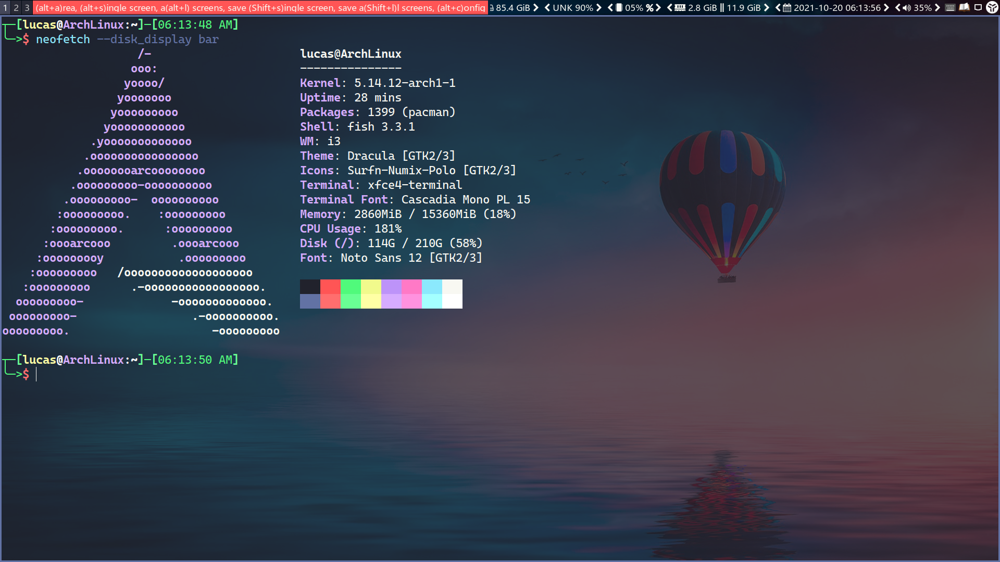

### **中文字体**

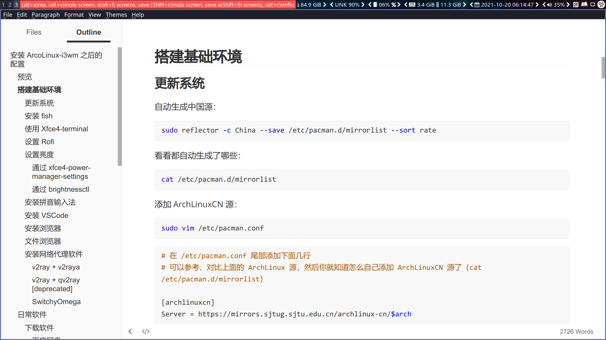

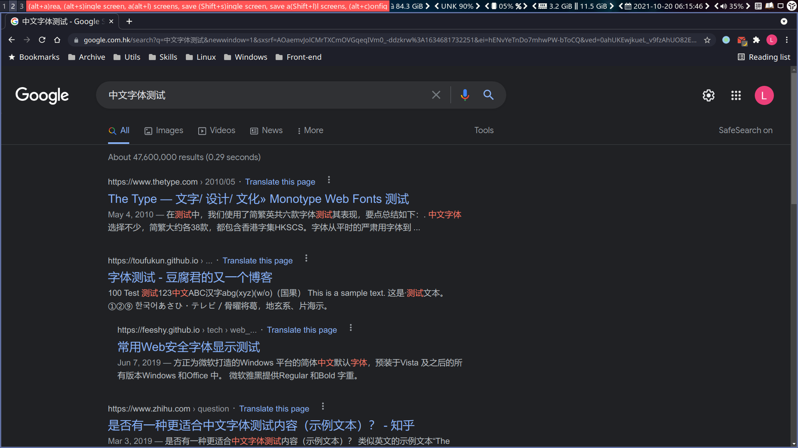

### GTK 主题

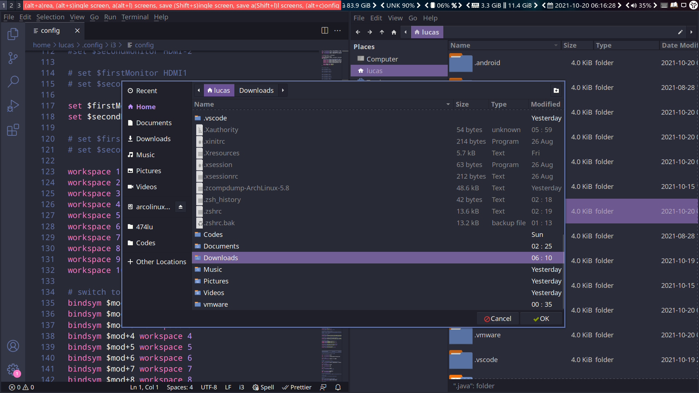

### 多屏显示

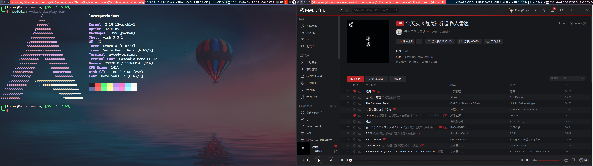

<br>

<br>

<br>

## 搭建基础环境

### tldr

```bash
# 史上最好用的命令：tldr
# 哪里不会点哪里，妈妈再也不用担心我不会用命令也不敢用 man 看文档了
# 唯一缺点：不代理第一次查询速度很慢，很可能查询失败
```

```bash
# 例
# 开启代理，具体端口号取决于你的代理软件的配置
export http_proxy=http://127.0.0.1:1081/; export https_proxy=$http_proxy;

# 查询 reflector 怎么用
tldr reflector
```

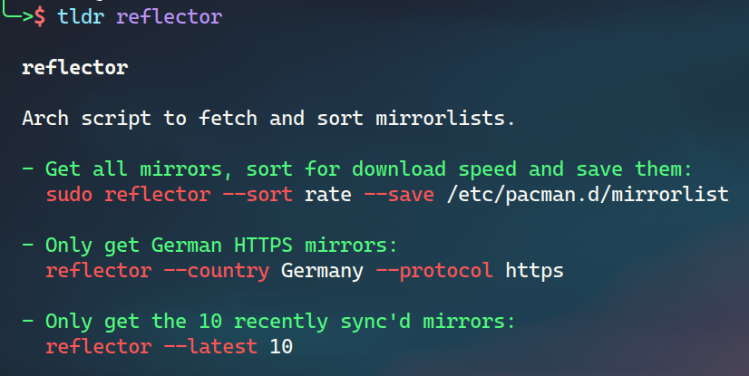

### 更新系统

自动生成中国源：

```bash
sudo reflector -c China --save /etc/pacman.d/mirrorlist --sort rate
```

看看都自动生成了哪些：

```bash
cat /etc/pacman.d/mirrorlist
```

刷新

```bash
sudo pacman -Syy
```

添加 ArchLinuxCN 源：

```bash
sudo vim /etc/pacman.conf
```

```bash
# 在 /etc/pacman.conf 尾部添加下面几行
# 可以参考、对比上面的 ArchLinux 源，然后你就知道怎么自己添加 ArchLinuxCN 源了（cat /etc/pacman.d/mirrorlist）

[archlinuxcn]
Server = https://mirrors.sjtug.sjtu.edu.cn/archlinux-cn/$arch
```

```bash
sudo pacman -Syy
sudo pacman -S archlinuxcn-keyring
```

接下來你就可以使用 [yay](https://github.com/Jguer/yay) 了。

最后更新系统：

```bash
sudo pacman -Syyu
reboot
```

如果在关机界面卡死了，直接断电就行了。关于这方面的配置可以看我的 [Configurations.md](Configurations.md)。

<br>


### 安装 fish

人生太短，我用 fish。

`Mod+Enter` 打开终端。（Mod 指 Windows 键，以下不再赘述）

```bash
sudo pacman -Syy fish
chsh -s /bin/fish # 更换当前用户默认的 shell 为 fish
```

然后按 `Mod+x`，选择 `Logout`，重新登录。


### 使用 Xfce4-terminal

目前 Arcolinux 默认使用的是 terminal 终端，但它使用起来依然不够无脑，因此我推荐使用已经预装好的 Xfce4-terminal。

首先打开 i3 config 文件。

```bash
vim .config/i3/config
```

然后找到下行：

```bash
bindsym $mod+Return exec --no-startup-id termite;focus
```

将其中 termite 更换为 xfce4-terminal

```bash
bindsym $mod+Return exec --no-startup-id xfce4-terminal;focus
```

后面的几行可以全部注释。

```bash
# bindsym $mod+KP_Enter exec --no-startup-id termite;focus
# bindsym control+mod1+t exec --no-startup-id termite; focus
# bindsym control+mod1+Return exec --no-startup-id termite; focus
# bindsym control+mod1+KP_Enter exec --no-startup-id termite; focus
```

然后 `Mod+Shift+R` 重启 i3。此时按下 `Mod+Enter` 即可启动 Xfce4-terminal，右键选择 Preferences 即可设置。

小提示：你也可以按 F12 启动 drop-down xfce4-terminal。


### 设置 Rofi

> **更新：**
>
> - **dmenu 更轻量**
> - **uTools 功能更丰富**

```bash
yay -S rofi utools
```

rofi 是一个软件启动器，对于新手可以先**暂时使用 rofi**，之后尝试 dmenu 和 uTools。

打开 i3 config，找到下面一行：

```bash
bindsym $mod+F12 exec --no-startup-id rofi -show run -font "Noto Sans 13"
```

将其更改为：

```bash
bindsym $mod+d exec --no-startup-id rofi -show run -font "Noto Sans 13"
```

然后重启 i3。试试 `Mod+d` 启动 rofi。

小提示：你可以使用 rofi-theme-selector 来选择 rofi 主题。


### 设置亮度

有些机器亮度不是开箱即用的，下面介绍两种设置方法。

#### 通过 xfce4-power-manager-settings

使用 rofi 打开 xfce4-power-manager-settings，然后选上 Handle display brightness keys。

step count 指的是除数，即 100 / (step count)。比如我这里设置了 20，那么我没按一次亮度键，它都会增加或者减少 5% 的亮度。

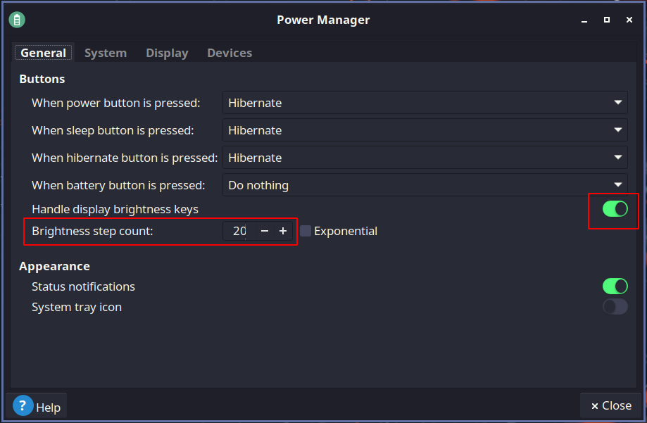

然后再试一下笔记本的亮度功能键。

#### 通过 brightnessctl (更推荐这个)

```bash
sudo pacman -Syy brightnessctl
brightnessctl set 30%
```

在 i3 config 中设置：首先找到此行

```bash
bindsym XF86MonBrightnessUp exec --no-startup-id xbacklight -inc 20 # increase screen brightness
bindsym XF86MonBrightnessDown exec --no-startup-id xbacklight -dec 20 # decrease screen brightness
```

然后将这两行注释，并在其后加上

```bash
bindsym XF86MonBrightnessUp exec --no-startup-id brightnessctl -q s +5%
bindsym XF86MonBrightnessDown exec --no-startup-id brightnessctl -q s 5%-
```

然后重启 i3。试试笔记本的亮度调节按键。

<br>


### 安装拼音输入法


>  推荐看这个 wiki：[Fcitx5 (简体中文)](https://wiki.archlinux.org/title/Fcitx5_(%E7%AE%80%E4%BD%93%E4%B8%AD%E6%96%87))。

没必要装 bug 满满的搜狗输入法，现在 fcitx5 带的 fcitx5-chinese-addons 已经很好用了。

```bash
sudo pacman -S fcitx5-im fcitx5-chinese-addons fcitx5-pinyin-zhwiki
```

在 i3 config 中设置 fcitx5 自启动：

```bash
# Input method
exec --no-startup-id fcitx5
```

设置输入法的环境变量：

```bash
# 如果你使用的是 startx，那就 vim ~/.xinitrc
# 不想用 ~/.xprofile，用 ~/.pam_environment 也可以

vim ~/.xprofile
```

```bash
# 加入以下三行

GTK_IM_MODULE DEFAULT=fcitx
QT_IM_MODULE  DEFAULT=fcitx
XMODIFIERS    DEFAULT=@im=fcitx
INPUT_METHOD  DEFAULT=fcit
```

然后打开 fcitx5-configtool，在 Input Method 中添加 pinyin。

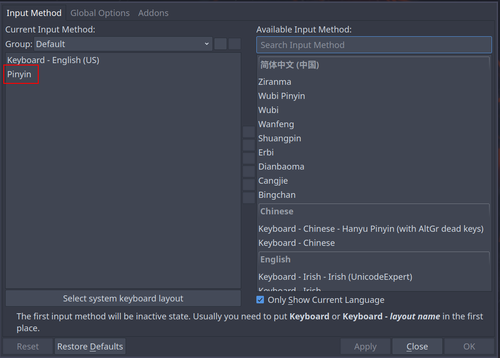

然后重启或者重新登录，之后按 Shift 或 Ctrl + Space 打开输入法（假设你已经按照我说的设定了自启动）。

<br>

**其它的设置可以看 fcitx5-configtool 里面的 Addons 一页，里面有很多好用的 Addon。**

**例如：**

- **Clipboard** (可以使用功能更强大 uTools 剪切板插件)
- **Cloud Pinyin**
- **Pinyin （在这里设置候选栏数目才会生效）**


### 安装 VSCode

```bash
sudo pacman -S visual-studio-code-bin


sudo pacman -S sublime-text-4
```

然后安装 i3 语法高亮插件。之后就可以使用 VSCode 愉快地配置了。

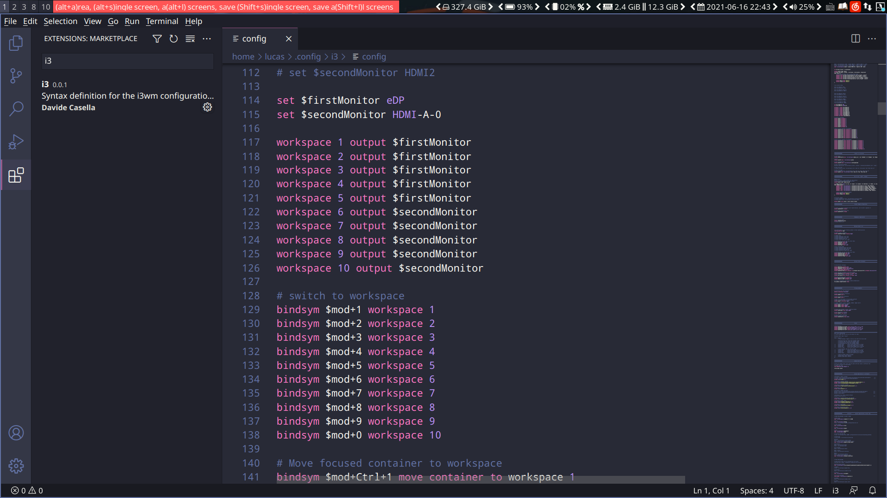


### 安装浏览器

```bash
sudo pacman -S google-chrome ublock-origin
sudo pacman -S chromium chromium-ublock-origin-git

# sudo pacman -S brave-bin
```


### 文件浏览器

已经预装好了 Thunar 文件浏览器，使用 Mod+Shift+Enter 打开。


### 安装网络代理软件

#### v2ray + v2raya

```bash
sudo pacman -S v2ray v2raya
```

在 i3 config 中设置：

```bash
exec --no-startup-id v2raya --passcheckroot --config ~/.config/v2raya
```

<br>

#### v2ray + qv2ray [deprecated]

```bash
sudo pacman -S v2ray qv2ray
```

在 i3 config 中设置 qv2ray 自启动：

```bash
# Proxy
exec --no-startup-id qv2ray
```

qv2ray 在重新登录之后会出 bug，无法正常启动，可以创建下面的脚本：

```bash
touch ~/.config/qv2ray/init.sh
chmod u+x ~/.config/qv2ray/init.sh
vim ~/.config/qv2ray/init.sh
```

```bash
#!/bin/bash

killall qv2ray
kill qv2ray
sleep 2
exec qv2ray
```

然后将上面的脚本放入 i3 config 中，并注释之前的自启动代码：

```bash
# Proxy
# exec --no-startup-id qv2ray
exec --no-startup-id ~/.config/qv2ray/init.sh
```


#### clash

```bash
# 没错，这个包名就是这么脑残。
# 如果不是我仔细看了那一列软件列表，我可能永远都不知道 clash-for-windows-bin 有 linux 版本
yay -S clash-for-windows-bin
sudo ln -s /usr/bin/cfw /usr/bin/clash-for-windows
```


#### SwitchyOmega

Google Chrome 无法直接设置代理，而是依赖于系统的代理。我们可以使用 SwitchyOmega 完成浏览器的代理配置。

下载链接：https://github.com/FelisCatus/SwitchyOmega/releases/download/v2.5.20/SwitchyOmega_Chromium.crx

然后将下载好的文件的 crx 后缀改为 zip，再在 Google Chrome 中打开 chrome://extensions/，开启 Developer mode，将 zip 文件拖入即可完成安装。

<br>


SwitchyOmega 的配置：

GFW list: https://raw.githubusercontent.com/gfwlist/gfwlist/master/gfwlist.txt

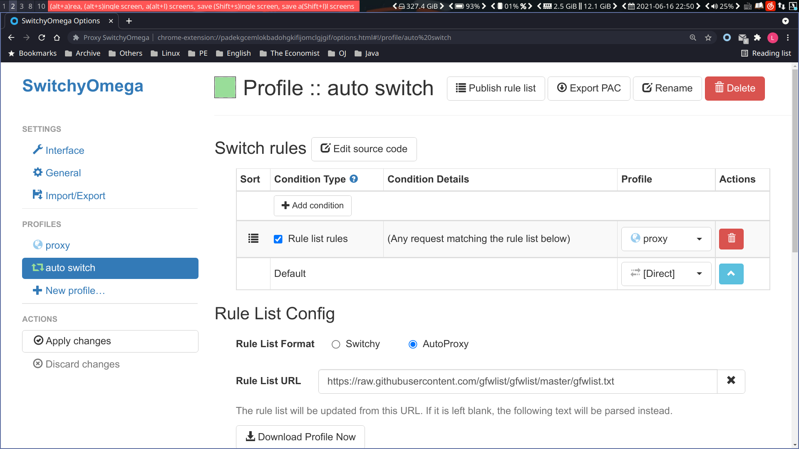

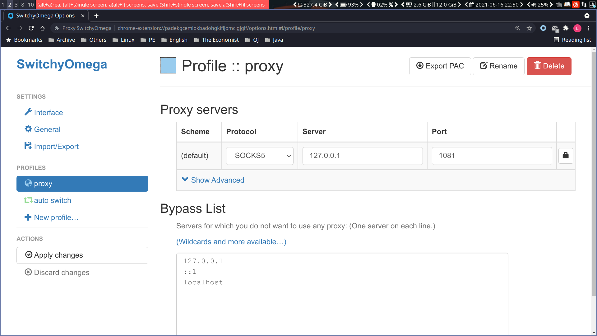

注意：SOCKS 的端口号取决于你的代理软件的具体配置。例如，我的 Qv2ray 是这样配置的：

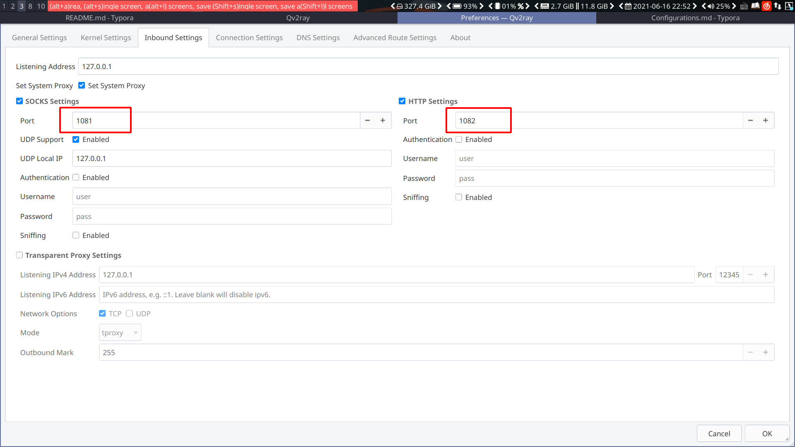


**到此为止，基本的环境搭建已经完成了，后面的配置都是个人喜好问题了。**

**本文后面的是软件推荐，更多的系统层次的配置可以看 [Configurations.md](Configurations.md)**。

除此之外，还可以参考我的 https://github.com/LucasWang474/Dotfiles。**<u>*（可以试试新装一个系统，然后直接把它复制且替换到 $HOME/ 下，然后看看效果）*</u>**

小提示：你可以使用 xfce4-appfinder 查看已安装的软件，学习学习 ArcoLinux 官方是如何配置系统的，这东西非常有用。快捷键是 Alt+F3。


<br>

<br>

## i3wm 的配置

参考我的 [Dotfiles](https://github.com/LucasWang474/Dotfiles).

i3wm 配置文件本身就很容易阅读，强烈推荐看看我的配置文件，个人认为还是极为优雅且高效的。

Tip: 修改之后按 Mod+Shift+R 重启 i3wm，如果报错则说明你语法错了。

```bash
git clone https://github.com/LucasWang474/Dotfiles.git
cp -r Dotfiles/.config/i3 ~/.config
```

<br>

<br>

## 日常软件

### 下载软件

#### 命令行

```bash
sudo pacman -S wget
```


#### 百度网盘

```bash
yay -S baidunetdisk-electron

mkdir ~/Downloads/BaidunetdiskDownloads # 然后在百度网盘中设置默认下载位置
```

改变任意 electron 软件的 zoom level 的方法：

```bash
# 以 baidunetdisk 为例，在后面加上 --force-device-scale-factor=ZOOM_LEVEL 就行了
baidunetdisk --force-device-scale-factor=1.75
```

永久更改 baidunetdisk 的 zoom level:

```bash
sudo vim /usr/bin/baidunetdisk
```

```bash
#!/bin/sh
LD_PRELOAD="/usr/lib/baidunetdisk/libbrowserengine.so:/usr/lib/baidunetdisk/libkernel.so" exec electron9 /usr/lib/baidunetdisk/resources/app.asar "$@" --force-device-scale-factor=1.75
```

#### 阿里云盘

```bash
yay -S aliyunpan-liupan1890

aliyunpan-liupan1890 --force-device-scale-factor=1.5
```


#### BT

```bash
yay -S qbittorrent-enhanced-git
```


#### 通用

- 直接浏览器下载

- 或者用 uget

  ```bash
  sudo pacman -S uget
  ```

- xunlei

  ```bash
  yay -S xunlei-bin
  ```

  


### 解压缩

对于在中文环境下使用 zip 压缩的文件，在 Linux 下解压可能会出现乱码的情况。下面介绍解决方案，更多请参考[官方文档](https://wiki.archlinux.org/title/Localization_(%E7%AE%80%E4%BD%93%E4%B8%AD%E6%96%87)/Simplified_Chinese_(%E7%AE%80%E4%BD%93%E4%B8%AD%E6%96%87)#zip_%E5%8E%8B%E7%BC%A9%E5%8C%85%E4%B9%B1%E7%A0%81)。

```bash
yay -S unzip-natspec

# 然后使用下面这条指令来解压
unzip -O gbk ARCHIVE_NAME.zip

# 可以将它设置为 fish abbr
abbr unzipgbk 'unzip -O gbk'
```


### 播放器

```bash
# mpv 其实非常好用，可能是 linux 下最好用的播放器了
sudo pacman -S mpv

sudo pacman -S netease-cloud-music
# 可以从 ~/.cache/netease-cloud-music/CachedSongs 中偷歌

# QQ, NeteaseClouseMusic, Kugou, Kuwo, Migu 等聚合版本
# 优点：能免费听大部分歌，能同步各个平台的帐号及歌单
# 缺点：不能下载，也不能从本地缓存中偷出来
yay -S listen1-desktop-appimage
sudo ln /opt/appimages/listen1.AppImage /usr/bin/listen1
```

**小技巧：netease-cloud-music 设置缩放**

```bash
sudo vim /usr/bin/netease-cloud-music
```

```bash
export QT_SCALE_FACTOR=1.4
```


### PDF

#### 阅读器

```bash
sudo pacman -S okular # 建议自己设置快捷键，
```

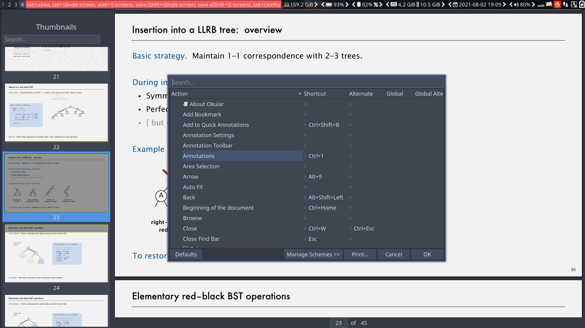

#### 编辑器

```bash
yay -S masterpdfeditor-free
```


### Markdown

```bash
sudo pacman -S typora

yay -S github-markdown-toc # Usage: gh-md-toc MARKDOWN_FILE.md

sudo pacman -S obsidian
```


### Office


```bash
# wps-office-cn 有点双标恶心人，我选择不用
yay -S wps-office wps-office-mime ttf-wps-fonts ttf-ms-fonts
```


### 思维导图

```bash
yay -S xmind-2020
```


### 图像编辑器

```bash
sudo pacman -S gimp
```


### 录屏

```bash
sudo pacman -S simplescreenrecorder
sudo pacman -S screenkey # print keys on the screen as you are entering
```


### 截图

```bash
sudo pacman -S flameshot
```

在 i3 config 中添加下列代码：

```bash
bindsym $mod+c mode "$screenshot"

set $screenshot (alt+a)rea, (alt+s)ingle screen, a(alt+l) screens, save (Shift+s)ingle screen, save a(Shift+l)l screens, (alt+c)onfig
mode "$screenshot" {
    # Some tools (such as import or xdotool) might be unable to run 
    # upon a KeyPress event, because the keyboard/pointer is still grabbed. 
    # For these situations, the --release flag can be used, which will 
    # execute the command after the keys have been released.

    bindsym mod1+a --release exec flameshot gui
    
    bindsym mod1+s --release exec flameshot screen -c
    bindsym Shift+s --release exec flameshot screen -p ~/Pictures/
    
    bindsym mod1+l --release exec flameshot full -c
    bindsym Shift+l --release exec flameshot full -p ~/Pictures/
    
    bindsym Shift+l --release exec flameshot full -p ~/Pictures/

    bindsym mod1+c --release exec flameshot config
    
    bindsym Return mode "default"
    bindsym Escape mode "default"
}
```

然后通过 Win+c 启动 flameshot binding mode。


### 闹钟时钟

```bash
sudo pacman -S gnome-clocks
```


### 通讯

```bash
sudo pacman -S telegram-desktop
```

<br>

<br>

## 学习软件

### Anki

```bash
# sudo pacman -S anki
yay -S anki-git
```


### Goldendict

```bash
sudo pacman -S goldendict hunspell hunspell-en_US
```

下载词典：https://freemdict.com/category/%e8%8b%b1%e8%af%ad/

<br>

<br>

## 编程软件

### vim

> - https://wiki.archlinux.org/title/vim
> - https://www.ruanyifeng.com/blog/2018/09/vimrc.html

```bash
vim .vimrc
```

```bash
set clipboard=unnamedplus

" set number
" set relativenumber

set showmode

set showcmd

" set mouse=a 

set encoding=utf-8

filetype indent on

filetype plugin on 

syntax on

set autoindent

set nocompatible 

set tabstop=4

set expandtab

set cursorline

set incsearch

set ignorecase

set smartcase

set noerrorbells
```


### fish

```bash
# 去除 greeting
set -U fish_greeting ""

# 插件管理器
yay -S fisher

# 配置 fish
fish_config
```

#### Plugins

> - [awesome.fish](https://github.com/jorgebucaran/awesome.fish)

- [fish-abbreviation-tips](https://github.com/Gazorby/fish-abbreviation-tips)

  ```bash
  fisher install Gazorby/fish-abbreviation-tips
  ```

- [z](https://github.com/jethrokuan/z) 

  **z** is a port of [z](https://github.com/rupa/z) for the [fish shell](https://fishshell.com/). Usage: https://github.com/jethrokuan/z/blob/master/man/man1/z.md

  ```bash
  fisher install jethrokuan/z
  ```

#### Tips

##### fish abbr

fish abbr 类似于 alias，个人觉得比 alias 更好用。

```bash
# 用法：abbr ABBR_NAME 'COMMANDS'
abbr pS 'sudo pacman -S'
abbr pSy 'sudo pacman -Syy'
abbr pSyu 'sudo pacman -Syyu'
abbr pr 'sudo pacman -R'
abbr pqs 'pacman -Qs'

# 命令行代理
abbr fuck 'export http_proxy=http://127.0.0.1:1082/; export https_proxy=$http_proxy'
```


### Git

```bash
git config --global user.email "474.lucas.wang@gmail.com"
git config --global user.name "Lucas Wang"
git config --global credential.helper store # 保存账号密码
```

#### Proxy

```bash
vim .gitconfig
```

```bash
[http]
    proxy = http://127.0.0.1:1081
```


### Java, Jetbrains

```bash
sudo pacman -S jdk8-openjdk openjdk8-doc
sudo pacman -S jdk11-openjdk openjdk11-doc
sudo pacman -S jdk-openjdk 
yay -S jdk11-jetbrains-imfix # 此版本可以正常使用输入法

yay -S intellij-idea-ultimate-edition intellij-idea-ultimate-edition-jre
sudo pacman -S webstorm webstorm-jre npm 
yay -S pycharm-professional python-coverage python-pytest python-tox
```

#### Intellij Plugins

- Theming
  - Dracula Theme
  - Atom Material Icons
  - Material Theme UI
- Choose Runtime
- IDE Eval Reset, [破解](https://www.exception.site/essay/how-to-free-use-intellij-idea-2019-3)

#### Set default Java environment

```bash
sudo archlinux-java status
sudo archlinux-java set java-11-openjdk
```

#### 解决输入法位置 bug

```bash
yay -S jdk11-jetbrains-imfix
```

进入 pycharm 或 idea，安装 Choose Runtimes 插件。

然后 Ctrl + Shift + A 搜索 Choose，选择 `Choose Runtimes...`，再选择。

然后选择 `build 11.0.11+9-b1504.5 [Local /usr/lib/jvm/java-11-jetbrains]`。

#### 解决 Intellij terminal 对 fish shell 的不适配

- 方法 1

  取消勾选 Shell integration 即可。

  

- 方法 2

  ```bash
  sudo rm -rf /opt/intellij-idea-ultimate-edition/plugins/terminal/fish
  sudo ln -s ~/.config/fish /opt/intellij-idea-ultimate-edition/plugins/terminal/fish
  ```

  


#### jshell

```bash
sudo ln -s /usr/lib/jvm/java-11-openjdk/bin/jshell /usr/bin/jshell
jshell
```


### Python

```bash
sudo pacman -S python python-pip
sudo pacman -S ipython jupyter-notebook

# 可以在 Intellij 中安装 python 插件，最后得到的功能和 pycharm-professional 实际上是一样的
# sudo pacman -S pycharm-community-edition
# sudo pacman -S pycharm-professional
```

### Zeal

离线文档

```bash
sudo pacman -S zeal
```

<br>

<br>

<br>

## Others

### File search

```bash
sudo pacman -S catfish
```

### File compare

```bash
sudo pacman -S meld
```

### File Share

#### nitroshare

```bash
sudo pacman -S nitroshare
```

#### KDE Connect

```bash
sudo pacman -S kdeconnect sshfs 
```

如果想要在 PC 和 Phone 之间共享文件，你想需要分别在各端**明确设定文件保存地址**。

### Make Windows Bootable USB

```bash
sudo pacman -S woeusb
```

